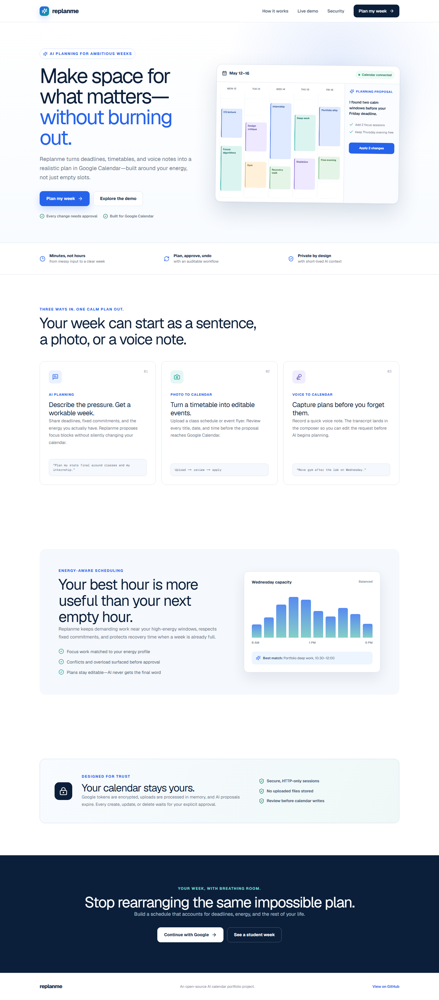
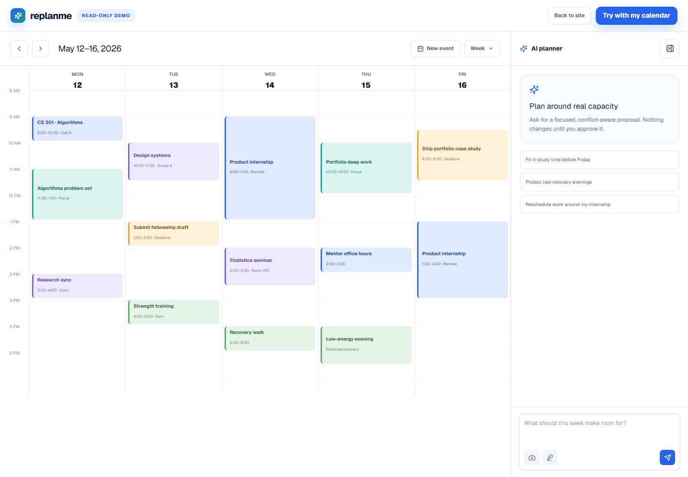
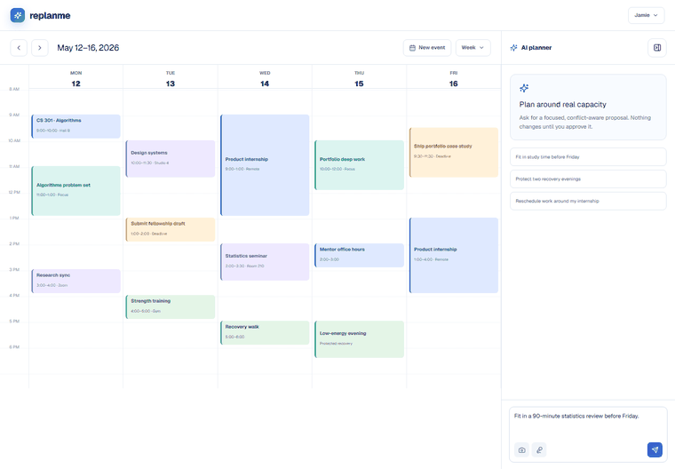
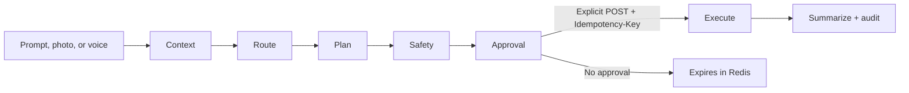
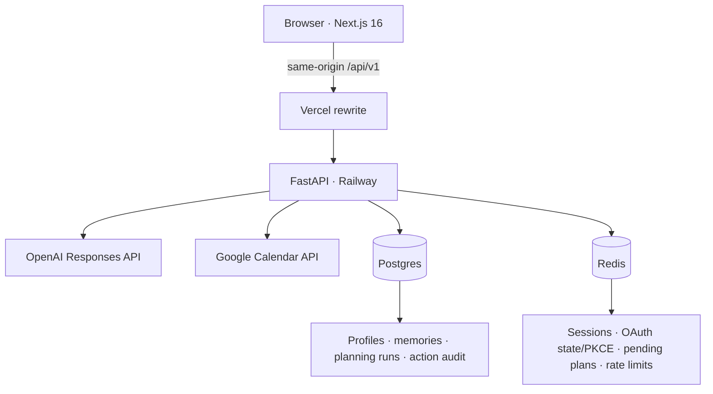

# replanme

[](https://github.com/avervill/replanme/actions/workflows/ci.yml)
[](LICENSE)
[](https://nextjs.org/)
[](https://fastapi.tiangolo.com/)

An approval-first AI calendar for students and early-career professionals. Replanme turns deadlines, timetable photos, and recorded voice notes into realistic Google Calendar proposals built around energy—not merely empty time.

> Live demo will be linked here after the Vercel production project is re-authenticated.



## Why this project

Most calendar assistants optimize for open slots. Replanme treats capacity as a constraint: it considers fixed commitments, focus windows, recovery time, and conflicts, then asks the user to approve a typed change plan before any write.

- **AI planning** — describe deadlines and constraints, then review a concrete proposal.
- **Photo to calendar** — extract a timetable in memory and edit every event before approval.
- **Voice to calendar** — transcribe a recording into the composer; transcription never triggers a write.
- **Safe execution** — ownership, expiry, idempotency, audit records, and compensating rollback.
- **Public demo** — explore a realistic student week without an account at `/demo`.



## Product flow





The assistant uses a modular LangGraph workflow: `context → route → plan → safety → approval → execute → summarize`. The graph only creates proposals; calendar mutations live behind a separate apply endpoint.

## Architecture



| Layer | Technology |
| --- | --- |
| Web | Next.js 16, React 19, TypeScript, Tailwind CSS, Lucide |
| API | FastAPI, Pydantic, SQLAlchemy async, Alembic |
| AI | LangGraph, OpenAI Responses API, Structured Outputs |
| Models | `gpt-5.6-luna`, `gpt-5.6-terra`, `gpt-transcribe` |
| Data | PostgreSQL, Redis |
| Providers | Google OAuth 2.0 + PKCE, Google Calendar API |
| Quality | Ruff, pytest + coverage, ESLint, Vitest, Playwright, axe |
| Hosting | Vercel (web), Railway (API, Postgres, Redis) |

## Repository

```text
apps/
  api/   FastAPI, LangGraph, migrations, provider adapters, tests
  web/   Next.js product, public demo, unit and browser tests
docs/
  assets/  portfolio screenshots and workflow GIF
```

## Local setup

Requirements: Node.js 22+, Python 3.12+, Docker, and `uv`.

```bash
git clone https://github.com/avervill/replanme.git
cd replanme
cp .env.example .env
docker compose up postgres redis -d
```

API:

```bash
cd apps/api
uv sync --extra dev
uv run alembic upgrade head
uv run uvicorn app.main:app --reload
```

Web:

```bash
cd apps/web
npm ci
npm run dev
```

Open [http://localhost:3000](http://localhost:3000). The browser calls only same-origin `/api/v1`; Next.js forwards requests using the server-only `API_ORIGIN`.

Generate a token-encryption key with:

```bash
python -c "from cryptography.fernet import Fernet; print(Fernet.generate_key().decode())"
```

## Public API

| Method | Path | Behavior |
| --- | --- | --- |
| `GET` | `/api/v1/auth/google/start` | Starts Google OAuth with state + PKCE |
| `GET` | `/api/v1/auth/google/callback` | Creates an opaque secure session |
| `GET` | `/api/v1/auth/session` | Returns the current browser session |
| `POST` | `/api/v1/auth/logout` | Revokes the Redis session |
| `GET/POST/PUT/DELETE` | `/api/v1/calendar/events` | Google Calendar CRUD; reads require a bounded range |
| `POST` | `/api/v1/assistant/messages` | SSE: `status`, `delta`, `plan`, `error`, `done` |
| `POST` | `/api/v1/plans/{id}/apply` | Explicit write with `Idempotency-Key` |
| `POST` | `/api/v1/imports/image` | In-memory OCR/vision; returns a plan only |
| `POST` | `/api/v1/voice/transcribe` | Returns transcript and detected language |

Interactive OpenAPI documentation is available at `/docs` on the API service.

## Security decisions

- Opaque session IDs are hashed in Redis and sent only in `HttpOnly`, `Secure`, `SameSite=Lax` cookies.
- OAuth state, PKCE verifiers, sessions, pending plans, idempotency results, and rate limits expire in Redis.
- Google credentials are encrypted with a dedicated `TOKEN_ENCRYPTION_KEY`.
- OAuth access is restricted by `GOOGLE_ALLOWED_EMAILS` while the app remains in testing mode.
- The OpenAI key and `API_ORIGIN` are server-only secrets.
- OpenAI calls use Structured Outputs, `store=false`, privacy-safe hashed `safety_identifier`, timeouts, and bounded retries.
- Images and audio are MIME/size validated, processed in memory, and never written to application disk.
- Every create/update/delete requires a separate apply call; partial provider failures trigger rollback and audit updates.

## Quality gates

```bash
# Backend
cd apps/api
uv run ruff check app tests alembic
uv run pytest

# Frontend
cd apps/web
npm run lint
npm run typecheck
npm run test
npm run build
npm run test:e2e
npm audit --omit=dev
```

The browser suite covers 1440px and 390px layouts, keyboard navigation, demo gating, an authenticated fake-provider flow, image review, voice-to-composer behavior, critical accessibility violations, and horizontal overflow.

## Deployment

- **Railway:** deploy `apps/api/Dockerfile`, attach a new Postgres database and Redis service, and set the variables in [`.env.example`](.env.example). The container runs `alembic upgrade head` before Uvicorn and exposes `/api/v1/health`.
- **Vercel:** use `apps/web` as the project root, set server-only `API_ORIGIN` to the Railway domain, set `NEXT_PUBLIC_SITE_URL`, and deploy from `main`.
- Set `GOOGLE_REDIRECT_URI` to `https://<vercel-domain>/api/v1/auth/google/callback`.

See [Railway deployment notes](docs/railway-deploy.md).

## Current limitations

- Google OAuth is intentionally restricted to allowlisted test accounts.
- The public demo uses deterministic sample data and never calls external providers.
- Calendar rollback is compensating rather than transactional because Google Calendar has no multi-operation transaction.
- Production OAuth requires a real test account check after secrets and redirect URIs are configured.

## Roadmap

- Real-time collaborative planning proposals
- Additional calendar providers
- More granular recurring-event review
- Evaluation datasets for planning quality and energy-fit scoring

Released under the [MIT License](LICENSE).
